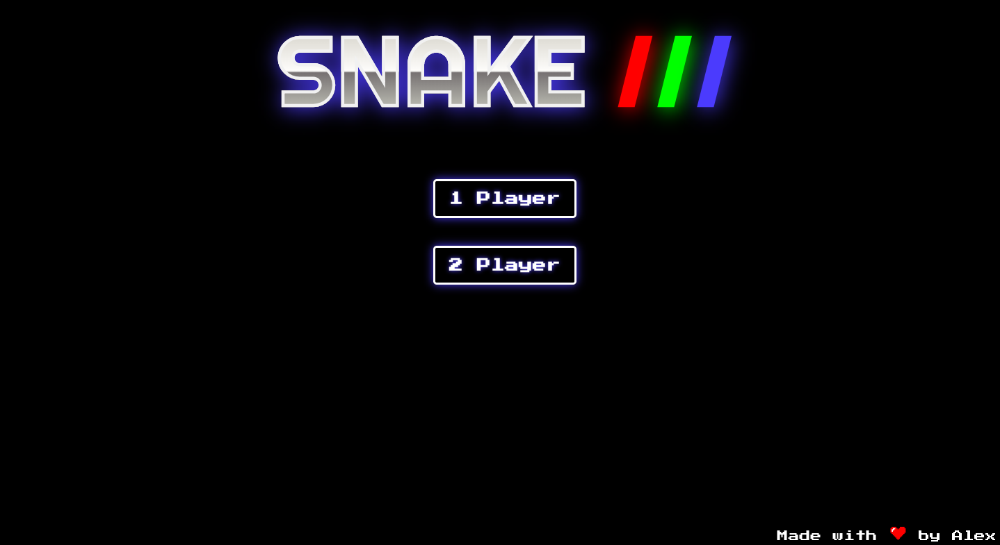
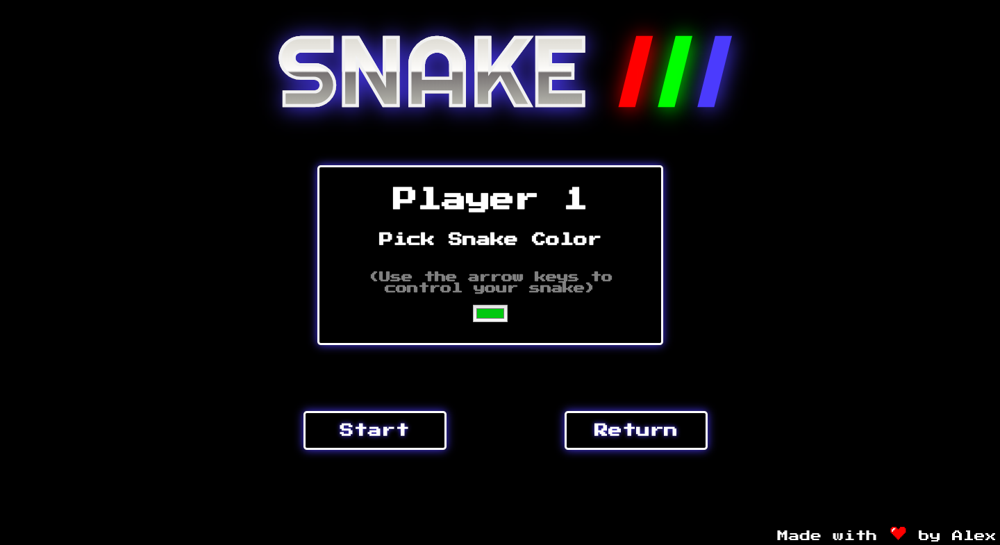

# General Assembly WDI Project 1: Snake

[GitHub Pages](https://alexfrancis95.github.io/wdi-project-one/)

[GitHub Repo](https://github.com/AlexFrancis95/wdi-project-one)

This project is my retro inspired take on the classic arcade and mobile game, Snake. The game features a two player mode in which two players can go head to head simultaneously, to grow their snake the longest and to earn the most points.

Race around the grid collecting as many points as you can whilst avoiding the walls of the grid, as well as your own tail and other players.

The game requires a quick mind and even quicker fingers as the snake speeds up the more that it eats!

Snake is my first project I have completed on General Assembly's Web Development Immersive course. The project was undertaken independently over the course of a week, and was my first opportunity to build a project of my choice and put to practice my new Javascript skills.

## Start Screen

## Single Player Menu

## Single Player Gameplay

## Two Player Menu

